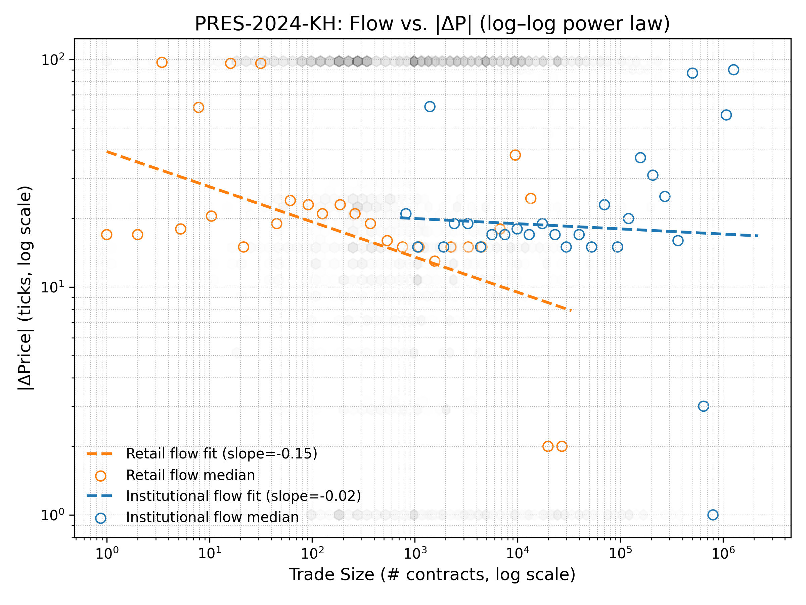

# Trader Behavior and Market Dynamics in the 2024 U.S. Election Prediction Markets: An Analysis of Retail and Institutional Impact on Kalshi

**Author:** Baz Cosmopoulos
**Date:** May 9, 2025

## Introduction
Recent years have seen a growing interest in prediction markets for a wide range of events, with political event contract markets often taking center stage. In particular, markets surrounding the 2024 US presidential election saw a great deal of activity, especially following their legalization on large platforms such as Kalshi in October 2024. Given the potential for alpha generation in these markets, understanding market microstructure, efficiency, and mispricing behavior is critical for making informed trading decisions. In this report, we examine both retail and institutional trades in the Kalshi event contract markets for the 2024 election, aiming to determine the following: first, the degree to which institutional and retail trades influence changes in contract price; and second, the degree to which institutional investors systematically correct retail-driven mispricings. Throughout this analysis, we will observe market-specific trading patterns and complex institutional behavior during price corrections, as well as points of caution to consider during future research.

## 2 Methodology
### 2.1 Data Source and Preparation
The supporting data for this exploration was collected using the Kalshi API ([Kalshi, Inc., 2025](#references)), and includes various details about each trade taking place from October 4, 2024 to January 20, 2025 in the PRES-2024-DJT and PRES-2024-KH Kalshi event contract markets. Trades were segmented using a Dirichlet-Process Gaussian Mixture Model (GMM) on log(trade_size). The 'institutional' region of the GMM was defined as the union of its three largest components, with trades where $P(\text{institutional}) > 0.80$ being classified as institutional, trades where $P(\text{institutional}) < 0.20$ being classified as retail, and all other trades classified as uncertain and excluded from further analysis. For easier processing, the data was resampled into 1-minute time bars and stored in Parquet format for efficient analysis, with each time bar including the last price of the contract as well as institutional and retail net flows (defined as the sum of signed taker volume for each category).

### 2.2 Defining Mispricing Events
We generally define mispricings as deviations of the 1-minute contract price from a 5-minute short-term moving average. In this analysis, we identify these events using the z-score of percentage deviation from the MA, with a z-score threshold of $2.0$ and a rolling window of 60 minutes for the standard deviation of these percentage changes. Additionally, using a simpler, $1.5\%$ MA deviation threshold was also explored.

### 2.3 Analytical Approaches
To characterize the impact of both groups of traders, least-squares regression was used to estimate contemporaneous impact of trades, Power Law analysis to estimate the impact scale, and persistence ratios to estimate the duration of the impact. Mann-Whitney U tests and Hodges-Lehmann estimators were used to determine the significance of differences between the persistence ratios of both groups.

For the analysis of mispricing events, such events were first identified using the methods defined in 2.2. Then, using varying windows following the event ranging from 30-60 minutes, several key metrics were measured, including: the frequency with which institutional traders were active in the market shortly after a mispricing; the rate at which mispricings were corrected (defined as a reversion of over $75\%$ of the initial gap between the price and the MA); the proportion of post-mispricing volume attributed to institutions; the characteristics of the first institutional trade after a mispricing signal; and the degree to which price tended to revert to the MA in the observation window, even if correction was not achieved.

An analysis of flow dynamics during corrections was also completed. Specifically, after each mispricing event, cumulative net retail and institutional flow, flow in the corrective direction, and corrective flow normalized by mispricing size were calculated. Spearman correlations were computed to determine the relationship between mispricing magnitude and the strength and direction of retail and institutional flow following the mispricing.

Finally, bivariate Granger causality tests were conducted on appropriately differenced, stationary time series to test for predictive relationships within the trading data. Augmented Dickey-Fuller tests were used to verify stationarity, and the time series were repeatedly differenced until stationarity was achieved. Bivariate full-series tests were used to assess the predictive power of retail flow on subsequent price changes, as well as the predictive power of institutional flow on mispricing gap changes, and their inverses; event-based tests were used to assess the predictive power of institutional flow in gap closure. These tests were conducted separately using both the simple percentage deviation and z-score definitions of a mispricing. Also, it was observed that standard VAR models faced challenges with residual autocorrelation, so this analysis will focus on the bivariate results.

## 3 Empirical Findings
### 3.1 Trader Activity and Market Impact
#### 3.1.1 Trader Segmentation
Using the segmentation method outlined in 2.1, it was found that institutional trades had mean and median sizes of $5543$ and $1697$ contracts, with these being $117$ and $89$ for retail.

  

Figure 1: <em>GMM segmentation of log(trade_size) in the combined PRES-2024-DJT and PRES-2024-KH markets.</em>

Figure 1 shows that the DP-GMM cleanly separates retail trades from larger institutional blocks.

#### 3.1.2 Contemporaneous Price Impact
The least-squares regression yielded a DJT institutional flow coefficient of $3.06e-6$ with a p-value of $0.001$, with the retail coefficient for this market not being statistically significant ($p=0.454$). For the KH market, the institutional flow coefficient was $-6.95e-06$ with a p-value of $0.000$, with retail having a flow coefficient of $7.51e-05$ with a p-value of $0.037$. Power Law analysis yielded retail and institutional slopes of $-0.0818$ and $-0.0619$ respectively for the DJT market, and $-0.1544$ and $-0.0227$ respectively for the KH market.

<table>
  <tr>
    <td align="center">
      
       
      <em>(a) DJT market (slopes: retail -0.0818, inst. -0.0619)</em>
    </td>
    <td align="center">
      
       
      <em>(b) KH market (slopes: retail -0.1544, inst. -0.0227)</em>
    </td>
  </tr>
</table>

Figure 2: <em>Log–log price impact |delta P| vs. trade size in the DJT and KH markets, with hex‐bin density, binned medians, and fitted power‐law lines for retail vs. institutional flows.</em>

As you can see in Figure 2(a), the DJT market exhibits slopes near zero or slightly negative, suggesting median absolute price changes do not systematically increase, and may even slightly decrease, with higher 1-minute flow volumes. Meanwhile, Figure 2(b) shows that the KH market also has near-zero or negative slopes, with retail flow showing a more pronounced negative slope than institutional flow.

#### 3.1.3 Price Persistence
Median persistence ratios were consistently less than 1.0 for both markets, both trader types, and across horizons K=20,50,100 trades. In the DJT market, the median institutional persistence values and retail persistence values were not found to be significantly different across all windows (Mann-Whitney U p>0.6; Hodges-Lehmann CIs for median difference included zero), though institutional median point estimates were numerically higher. In the KH market, while the overall distributions of persistence ratios for retail and institutional trades differed significantly at windows of 20 and 50 trades (Mann-Whitney U p<0.05), their median values were not significantly different (Hodges-Lehmann CIs included zero), with institutional median point estimates also being numerically higher than retail. At the 100-trade window in KH, no significant difference was observed in either medians or overall distributions.

  
   
  

Figure 3: <em>Persistence ratios |delta P(0 to K)|/|delta P(0 to 1)| (log scale) at horizons K=20, 50, 100, stacked for (top) the PRES-2024-DJT market and (bottom) the PRES-2024-KH market. Top 1% of ratios clipped for clarity.</em>

### 3.2 Mispricing Events and Correction Dynamics
#### 3.2.1 Mispricing Event Characteristics
Generally, z-score defined mispricings exhibited more consistent gap closure than mispricings defined using the simpler MA percentage deviation method. It was observed that institutional trading activity occurred after approximately $80\%-90\%$ of mispricing events, depending on the window and mispricing definition used. It was also observed that the first institutional trade after a mispricing event was not in the corrective direction over half the time, except specifically in the DJT market and using the z-score mispricing definition.

#### 3.2.2 Event Flow Dynamics During Corrections
Post-mispricing flow dynamics differed significantly by market and mispricing definition, while being largely independent of changes from a 30 to 60-minute window.

In the DJT market, when mispricings failed to correct, this was typically associated with strong institutional flow in the direction opposing the correction, with the median institutional counter-flow magnitude for unsuccessful corrections being $10,564$ contracts; successful corrections saw neutral median institutional corrective flow. Unsuccessful events with institutional counter-flow were correlated with a weaker counter-flow for larger MA\% deviations, with a Spearman correlation of $0.133$ and a p-value of less than $0.001$. When defining mispricings by z-score, this correlation became non-significant. Also, MA\% corrections that occurred despite institutional counter-flow tended to occur when the initial mispricing was smaller (median $0.084$ cents), while institutional corrective flow was associated with successful corrections for larger initial mispricings (median $0.864$ cents). This pattern was reversed when defining mispricings by z-score, with the median initial mispricing z-scores being $3.41$ and $2.69$ for successful corrections with and without institutional help respectively.

In the KH market, greater initial MA\%-defined mispricings with unsuccessful corrections exhibited stronger corrective institutional flow (median $7,325$ net contracts traded in corrective direction) than mispricings with successful corrections (median $0$ corrective net contracts traded), with weaker institutional corrective flow during unsuccessful corrections being correlated with greater initial MA\% mispricings (Spearman $-0.139$, $p < 0.001$). Retail flow was largely corrective, but much more strongly so during unsuccessful corrections (median $105$ net corrective retail contracts traded during successful corrections and $2058$ during unsuccessful corrections). When using z-scores, both institutional and retail net contracts traded during unsuccessful corrections tended to be counter-corrective ($3965$ median counter-corrective institutional net contracts traded, and $6579$ across both retail and institutional). For the subset of unsuccessful corrections where institutions were flowing correctively, the negative correlation between the strength of the corrective flow and the size of the initial mispricing strengthened (Spearman $-0.309$, $p < 0.001$).

### 3.3 Predictive Relationships
#### 3.3.1 Granger Causality Full-Series Analysis
At all lags, in the KH market, changes in retail flow significantly predicted changes in the price of the contract (lags of 1-10 minutes, $p < 0.011$ always). This trend persisted for the inverse predictive relationship. In the DJT market, changes in retail flow predicted price changes with $p < 0.05$ at lags of 3 and 10 minutes, while past price changes predicted changes in retail flow at all lags from 2-10 minutes.

Also, in the KH market, changes in institutional flow were found to predict changes in MA\%-defined mispricing gaps at lags of 3, 5, and 10 minutes with $p < 0.02$, but only at 2 and 10 minutes when using z-scores; the inverse was true at lags of 5, 8, and 10 minutes with $p < 0.004$ for MA\%-defined mispricings, and not significant at any lag when using z-scores. In the DJT market, neither predictive direction was significant at any lag.

#### 3.3.2 Granger Causality Event-Based Analysis
Assessing whether changes in institutional flow predicted changes in mispricing gaps, showed very little predictive power; institutional flow changes significantly predicted gap closure in only $10\%-21\%$ of cases, depending on lag and market, and median p-values were all found to be greater than $0.5$.

## 4 Discussion
### 4.1 Group Influence on Market Price Moves
Overall, it is clear that no single group dominates price movement influence across all markets and parameters. Retail trading, for instance, seems to have a strong influence over price moves in the KH contract market; retail’s significant contemporaneous impact, distinct short-term persistence characteristics (with its ratio distributions differing significantly from institutional trades at 20 and 50-trade horizons), and Granger causality provide considerable evidence for this. This is in contrast to the DJT market, which seems to be more strongly influenced by institutional trading. While this influence is less strong than the influence retail trading has over the KH market, institutional trades still had the greater contemporaneous impact in this market, though their price persistence was not found to be significantly different from that of retail.

In general, both markets seem to be highly resilient to price moves from either group; we can see from the Power Law analysis that impact magnitude does not show a positive scaling with volume traded, instead indicating a flat to slightly inverse relationship. That said, the relationship between flow volume and price change magnitude differs by trader type; while retail generally trades in smaller amounts, the tendency for median absolute price changes to decrease with increasing volume is more pronounced for retail flow than for institutional flow.

### 4.2 Institutional Mispricing Correction
While institutions consistently step in and trade after mispricing events, their specific behavior is less straightforward than one might expect. Direct, immediate predictive power for gap closure in individual event windows, as measured by Granger analysis, is extremely limited, and the first institutional trades after a mispricing event are often in the direction of the mispricing, suggesting institutional responses may be momentum or liquidity-driven rather than corrective. Furthermore, post-mispricing institutional behavior differed significantly depending on the definition of mispricing used; in the KH market, for instance, MA\%-defined mispricings that failed to correct featured stronger corrective institutional flow, a trend that completely reverses if we switch to z-score-based mispricing definition. Institutional behavior in the DJT market was different still, with counter-corrective institutional flow being associated with failed corrections of MA\%-defined mispricings, successful corrections despite institutional counter-flow occurring for smaller mispricings, and successful corrections of larger mispricings often including institutional 'help' in the form of corrective flow. When using z-scores, successful corrections that occurred despite institutional counter-corrective flow conversely tended to occur with larger initial deviations.

One key theme was related to how institutional corrective or counter-corrective behavior scaled with mispricing magnitude. Specifically, in the KH market, the magnitude of unsuccessful institutional corrective flow decreased relative to the scale of the mispricing as mispricing magnitude increased, as evidenced by negative Spearman correlation for both mispricing definitions; in the DJT market, counter-corrective flow in unsuccessful corrections became weaker relative to the size of the mispricing as mispricing magnitude increase for MA\%-defined mispricings, as evidenced by the positive Spearman correlation (a relationship that did not hold for the z-score definition). This could indicate that institutions are hesitant to enter more volatile markets, or generally reluctant to push prices further from the MA.

The full-series predictive power between institutional flow and mispricing behavior was only present in the KH market, and occurred only for specific lags. This could point to the KH market being marginally less chaotic, with price moves more easily anticipated by institutions. Specific-event analysis yielded significant results only for a small subset of events across both markets and definitions.

## Conclusion
This analysis aimed to further understand retail and institutional behavior in the Kalshi prediction markets for the 2024 election, specifically the impact that retail and institutional trading has on price movement and the institutional role in correcting retail-driven mispricings. Overall, retail flow changes appeared more predictive of subsequent price changes in the KH market, while contemporaneous institutional OLS impact was significant and positive in the DJT; Power Law analysis indicated the median magnitude of retail price impact showed a more pronounced negative scaling with volume than institutional impact, suggesting high market resilience as increased 1-minute flow volumes generally did not lead to larger median absolute price changes. Additionally, while institutional participation post-mispricing is high, their role in correction is complex—evidenced by limited predictive power of past flow on next-minute gap changes in most individual mispricing events—and heavily dependent on mispricing definition (z-score defined ones being more clearly corrected). Dominant trends included this complex institutional response, market-specific price persistence characteristics where initial impactful trades primarily mean-reverted without consistently significant median differences between trader types, and some lagged predictive power of institutional flow changes on overall mispricing gap changes, notably in the KH market. Challenges included the lack of order book data and limited number of data points; despite these, we have gained a more nuanced and data-driven understanding of political prediction market microstructure. Further research avenues may include exploring the role of 'uncertain' trades, or incorporating order book data into the analysis.

## Data & Code Availability
All CSV data files and supporting code used in this analysis are publicly available at
[github.com/bcosm/2024_election_prediction_market_microstructure_analysis](https://github.com/bcosm/2024_election_prediction_market_microstructure_analysis).

## References
1.  Kalshi, Inc. (2025). *Kalshi API*. Retrieved May 9, 2025, from <https://www.kalshi.com/api>